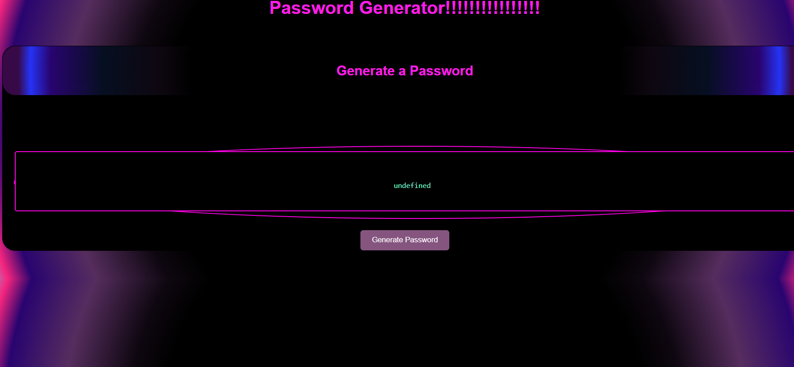

# Password Generator

## Description
This is a simple password generator application that allows users to generate strong and secure passwords based on their specified criteria.

## Screenshot

## Features
- User can specify the length of the password.
- User can choose to include uppercase letters, lowercase letters, numbers, and special characters in the password.
- User can generate multiple passwords at once.
- User can copy the generated password(s) to the clipboard.

## Installation
1. Clone the repository: `git clone https://github.com/your-username/password-generator.git`
2. Navigate to the project directory: `cd password-generator`
3. Install the dependencies: `npm install`

## Usage
1. If running locally, right click and open from browser.
2. Follow the prompts to specify the password length and criteria.
3. Once the password(s) is generated, it will be displayed on the console and copied to the clipboard.

## Contributing
Contributions are welcome! If you find any issues or have suggestions for improvements, please open an issue or submit a pull request.

## License
This project is licensed under the [MIT License](https://opensource.org/licenses/MIT).